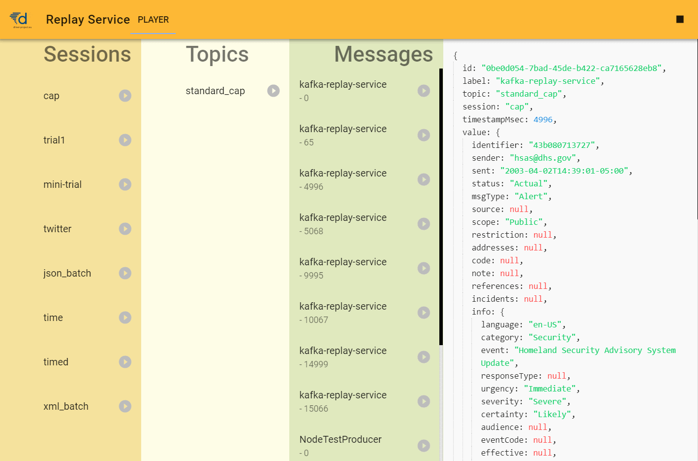

[](https://travis-ci.com/DRIVER-EU/kafka-replay-service)

# Kafka-Replay-Service

A simple REST (+web sockets) service to play (publish) a sequence of messages to a Kafka topic. The messages you can play are based on their location in a folder (following the convention over configuration principle). The folder is actively watched, and new files will be automatically available.



Replay logged messages that are stored inside a, potentially mounted, folder. The folder layout is using the following convention, so you can either write your own message, one message per file, or, alternatively, use a log file from Landoop's Kafka TOPICS UI or our own [kafka-topics-logger](https://www.npmjs.com/package/kafka-topics-logger). Please
note that the log files must be in JSON, using wrapped unions, to avoid ambiguity:

```console
ROOT
- logs
  - SESSION_NAME
    - TOPIC_NAME
      - TIMESTAMP_FILENAME
  - SESSION_NAME2
    - [Kafka TOPICS UI log file].json
```

Messages that belong to each other are added to the same session. The topic name is the name of the topic to publish the messages to. When a TIMESTAMP (a number in msec) is set, it is used to send the message after TIMESTAMP msec.

The REST API is documented using OpenAPI/Swagger at [http://[HOST]:[PORT]/api-docs/](http://localhost:8200/api-docs).

Via web sockets, your client may receive a `session_update` notification that something has changed, after which you should GET all session data again.

## Filename convention for single messages

The message file's filename convention informs us when to send it:

- It is just a name: you can publish them step-by-step or all in one go
- It is in the format 12345... (only numbers, or, in Regex /d+): it represents the offset in msec since you pressed play
- Optionally, the previous format may be augmented by a textual description, such as 0001_Initialize_msg, in which case the 'Initialize msg' is used as the label of the message in the GUI.

## Extension

Finally, the message file's extension informs us how to read it. We support the following inputs:

- .xml, for XML messages
- .json or .geojson for JSON and GeoJSON messages, respectively.

## Use cases (TO BE DONE)

### Playback step-by-step

The user can select a `session_name` from the GUI, and either send messages by selecting them, and pressing play, or by sending them one after another (batch mode).
In case we are dealing with multiple topics, the user can unselect specific topics in batch mode.

### Playback scenario-based

Finally, if there is a time message signal on the test-bed, playback messages based on the external clock. The scenario duration is used to determine when to send a message.

## Installation instructions

```console
npm i -g kafka-replay-service
```

To run the application, execute `kafka-replay-service` from a folder that contains log files as outlined above, otherwise the service will be empty.

## Build instructions

From the command prompt, install all dependencies using `npm i`. Under Windows, using Node v9, you may run into an installation error when installing `node-expat`. In that case, you can try the following:

```console
npm i -g node-gyp
cd node_modules\node-expat
node-gyp rebuild
```

Optionally, you may also need to install the npm production tools, from an admin prompt: `npm install --global --production windows-build-tools`.

To build the application, you can do the following:

```console
npm install
npm run build
```

This will build both service and GUI application and copies the created website into the service `public` folder. You can now start the app using:

```console
npm start
```

**Please note that the service requires a local `logs` folder that contains the to be transmitted message logs. You can generate a log file by using the Kafka Topics UI and downloading a topic, or by using the [Kafka-topics-logger](https://www.npmjs.com/package/kafka-topics-logger).**

## Development instructions

In order to develop the app, use `npm run dev`.

## Docker

The batch file 'CreateDockerImages.bat' will generate a local docker image 'kafka-replay-service'.

To start the kafka-replayer-service execute 'docker-compose up -d' and open a browser with 'http://localhost:8080'

The docker-compose will start also the KAFKA containers.

View topics in browser: http://localhost:3601